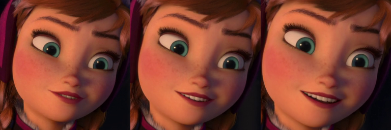

# FaceCrop

Program to take an image and crop to just a face

### Packages

`pip install -r requirements.txt`

## Process

- Update `options.py` to point to the correct files.

- Update `scenes.txt` to only include the frames of scenes which contain the face. If the face is in the whole video leave this blank.

- Run `face_crop.py` to generate images in the `output` folder.  It also generates a description file `scene_info.txt` which contains filename, x, y, width and height information for the selected images.

- Manually check the generated frames and remove any incorrect files.

- As there can only be 1 correct face at a time, you can run `create_duplicate_list.py` to highlight frames which contain more than 1 image. Manually remove any duplicated images.

- Once there is only 1 of each frame, run `clean_filenames.py` to clean filenames, and remove deleted frames from `scene_info.txt`.

- There may be several frames where the classifier failed to recognise the face, run `create_missing_images.py` to create missing images by taking averages of frames before and after the gap.  The script has a variable `gap` that signifies how many frames it should fill if it finds a gap that size. This can work up to any size, but depending on the video large values may add unwanted extra frames.

- Run `create_triplets.py` to concatenate 3 frames together into 1 image.  This is the input required for the RecycleGAN project.

